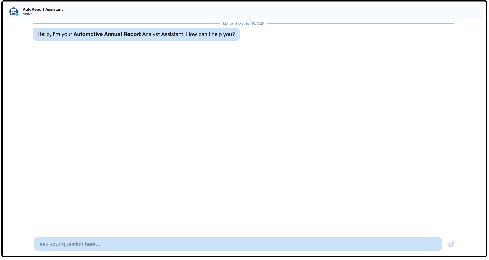

# AutoReport AI Assistant

## Project Description
AutoReport AI Assistant helps automotive analysts extract and analyze key financial metrics from Annual Reports. Using a Retrieval-Augmented Generation (RAG) model, it automates retrieval of revenue, EBITDA, growth, and enables quick comparative analyses across companies and sectors. 

## Getting Started

### Prerequisites
- Python 3.10+
- Node.js (for frontend)
- pip or poetry for Python dependencies
- Git

### Installation
1. Clone the repository:
   ```bash
   git clone https://github.com/Ghassan-Dib/AutoReport-AI-Assistant.git
   cd AutoReport-AI-Assistant

2. Install backend dependencies:
    ```bash
    pip install -r backend/requirements.txt

3. Install frontend dependencies: 
    ```bash
    cd frontend
    yarn install

### Running the Application

- Backend
    ```bash
    cd backend
    python main.py

- Frontend
    ```bash
    cd frontend
    yarn dev

Open your browser at http://localhost:3000 (if using frontend) or use the console interface for queries.

### Example


